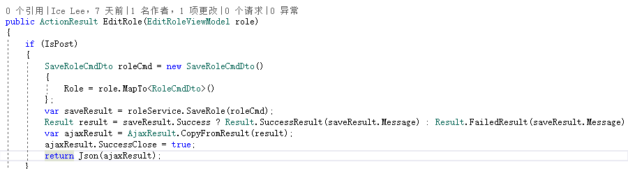
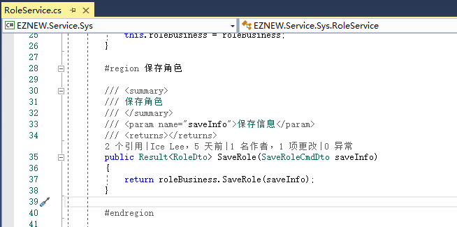
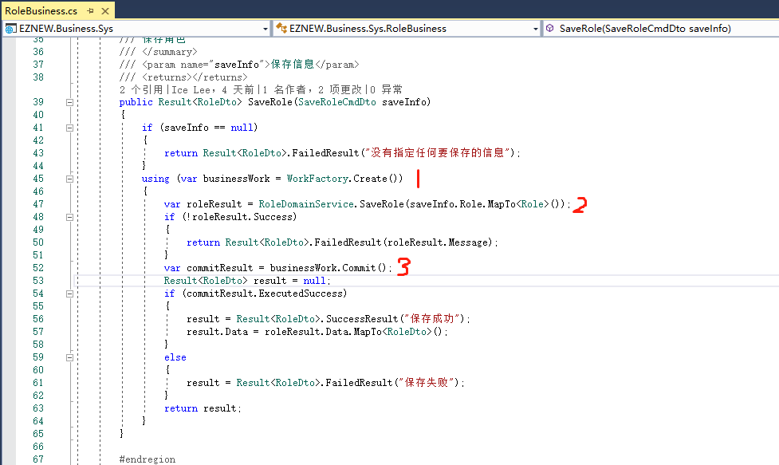
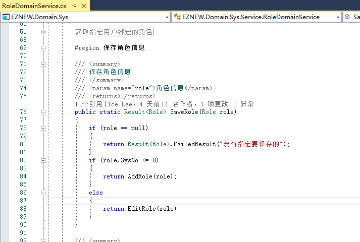

# 基本操作

+ 保存数据(新增/修改)
+ 工作单元的基本使用
+ 熟悉修改表达式的使用
+ 查询对象基本概念
+ 了解查询表达式的基本使用

## 保存【角色】

1：填写角色信息

2：SysController调用RoleService

3：RoleService调用RoleBusiness

4：RoleBusiness执行业务工作，这个业务工作中主要包含3个主要工作步骤
    + 创建工作单元，推荐使用using语法来明确定义一个工作任务执行区域，第一是为了业务代码的结构清晰，
      最重要的是在工作执行完成返回后不需要手动去管理工作单元对象的释放工作
    + 调用角色的领域服务执行具体的角色保存工作
    + 工作提交，在前面完成的一系列工作，例如保存，更新，删除等只有在将整个工作提交后才会将这些变化
      反应到数据库中

5：XXXBusiness主要负责业务事务中一些列工作任务的管理，具体的业务逻辑通常都在各自的对象或者领域服务中，
   所以这里调用的是领域服务RoleDomainService保存具体的角色对象

## 编辑数据

## 查询数据

## 删除数据