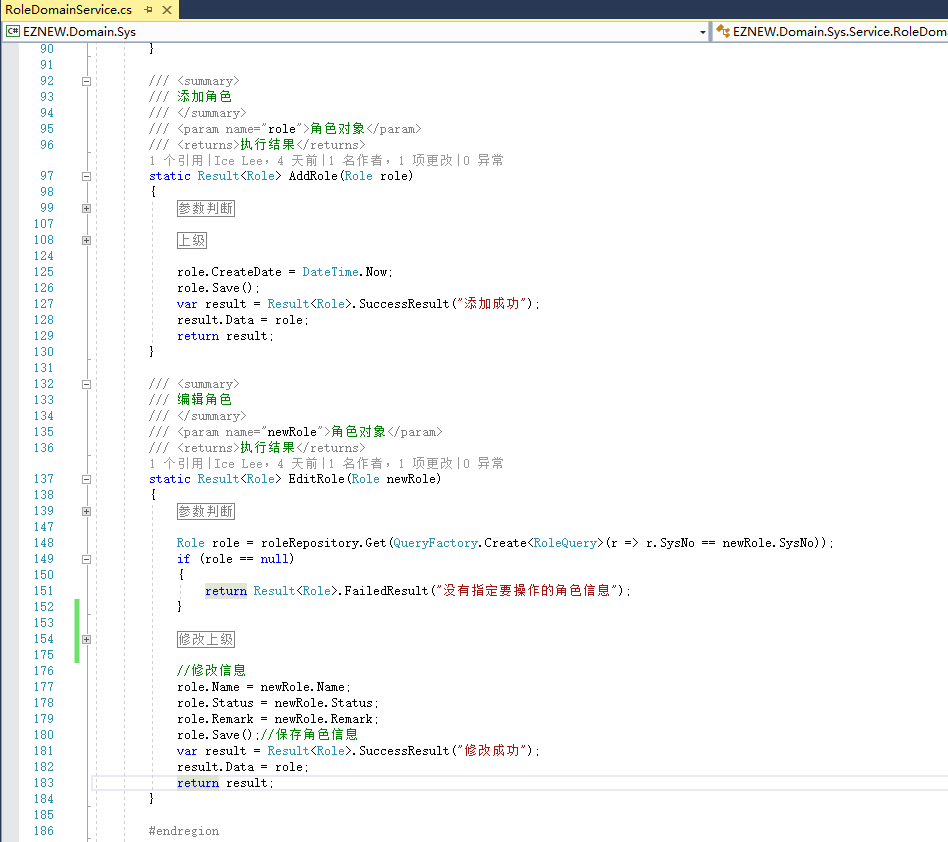
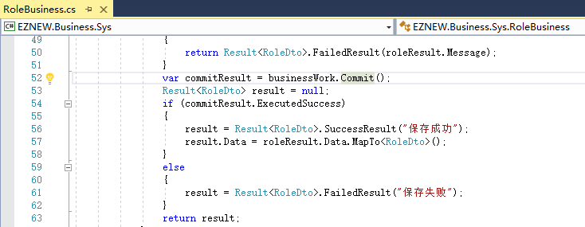
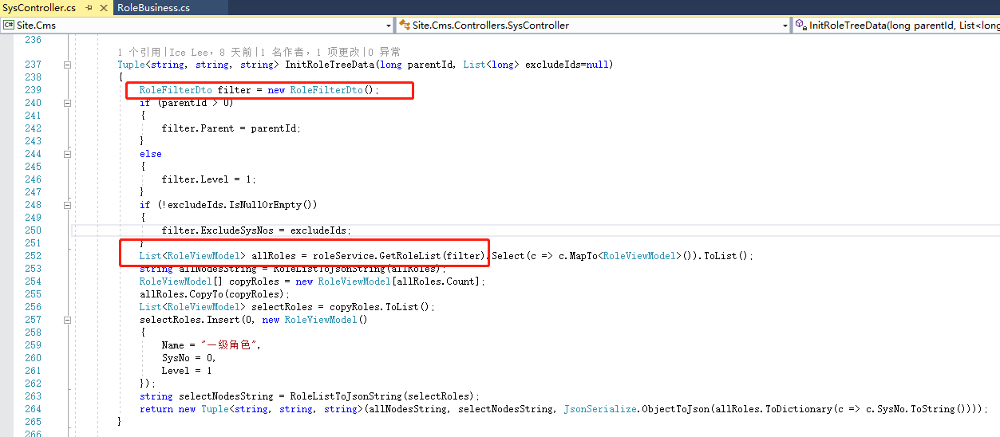
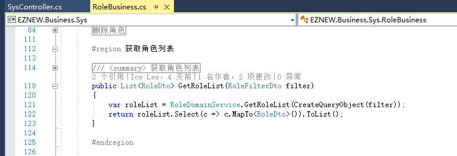
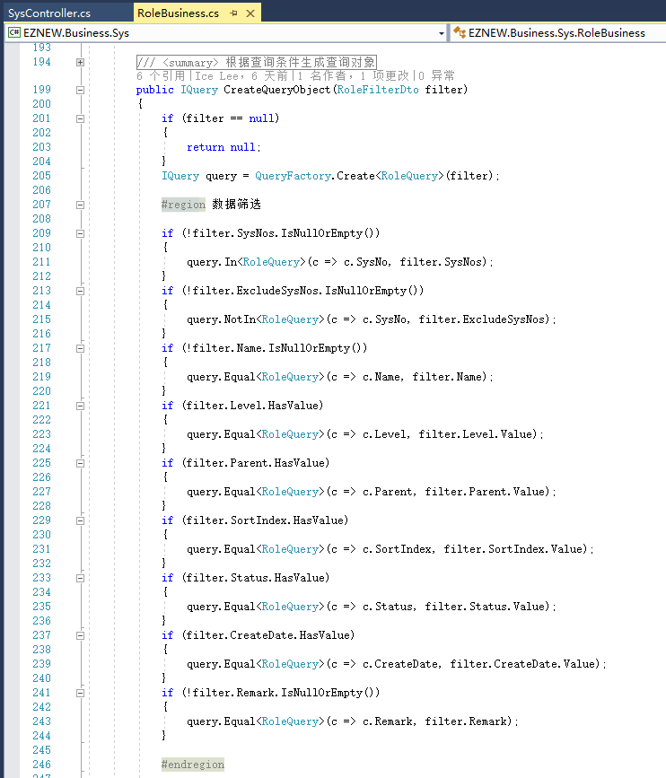
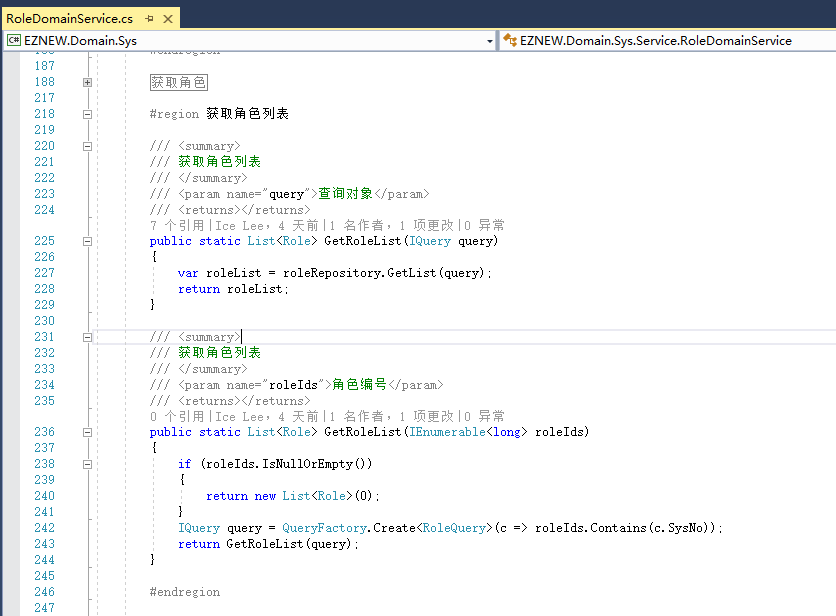
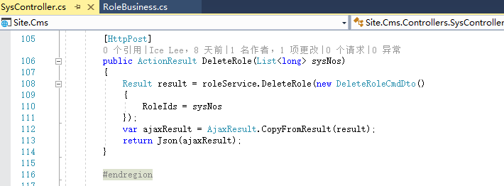
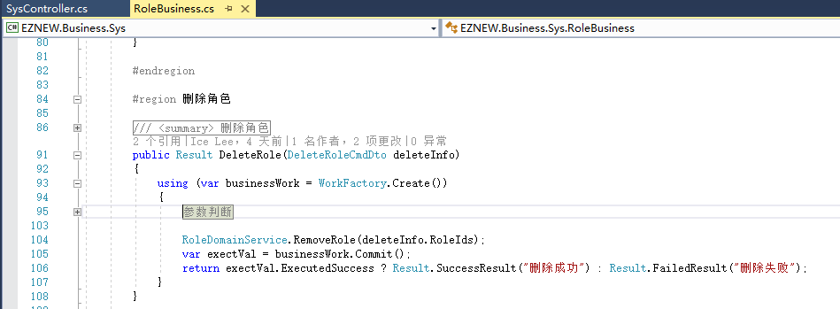
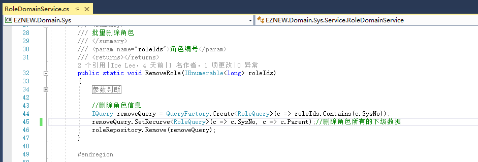

# 基本操作

+ 保存数据(新增/修改)
+ 工作单元的基本使用
+ 熟悉修改表达式的使用
+ 查询对象基本概念
+ 了解查询表达式的基本使用

## 保存【角色】

1：填写角色信息

2：SysController调用RoleService

3：RoleService调用RoleBusiness

4：RoleBusiness执行业务工作，这个业务工作中主要包含3个主要工作步骤
    + 创建工作单元，推荐使用using语法来明确定义一个工作任务执行区域，第一是为了业务代码的结构清晰，
      最重要的是在工作执行完成返回后不需要手动去管理工作单元对象的释放工作
    + 调用角色的领域服务执行具体的角色保存工作
    + 工作提交，在前面完成的一系列工作，例如保存，更新，删除等只有在将整个工作提交后才会将这些变化
      反应到数据库中

5：Business主要负责业务事务中一些列工作任务的管理，具体的业务逻辑通常都在各自的对象或者领域服务中，
   所以这里调用的是领域服务RoleDomainService来执行具体的保存逻辑，通过参数决定执行新增还是修改逻辑，
   不管是执行新增还是修改，最后都是通过调用对象的Save方法进行保存，当然这里也可以直接通过仓储（repository）
   对象保存数据,这里虽然我们执行了不同的新增和修改逻辑，但是也只是针对业务上执行不同的对象赋值等相关逻辑，
   对象数据处理完成以后都是执行的保存（Save）方法，因为在这里我们是将我们的对象看作一种资源，资源和仓储之间
   常常涉及到的关系也就是保存，取出，移除（就好像现实中货物和仓库之间的关系），至于最终执行的是新增资源还是修改
   现有资源是框架中的资源管理机制根据对象的状态在执行提交的时候自动进行判断的，资源的管理机制会在后续文章中详细讲解，
   （这里还涉及到领域对象，领域服务，领域逻辑的设计，交互和排列的合理性，例如通常会碰到是将业务逻辑放在对象中还是
   领域服务中的问题，这个没有统一的标准，只能根据自己的业务场景和要执行的操作具体分析，通常建议是和某一对象
   本身关系比较紧密的操作放到对象中去，其它一些复杂的不太适合放在对象中的代码移到领域服务中去）

6： 在Business中我们是通过最后的提交(Commit)结果来判断是否执行成功并返回结果的，执行工作提交返回的是一个CommitResult对象，
    它包含了最终提交结果的反馈信息，这当中包含了几种不同的属性信息，要判断自己的工作是否真正的提交成功就要根据具体执行的业务
    功能来判断
    
    + ExecutedSuccess：提交执行功能，并且执行的操作确实影响了相应的数据
    + NoneCommandOrSuccess：未提交任何操作或执行成功，意思就是这一的工作提交可能最终没有执行任何
                            真正有意义的数据操作或者全部执行成功，这种情况通常出现在修改或者删除
                            数据操作中，例如在对一个数据对象经过一系列操作后，最后提交的时候
                            数据管理器发现实际上它并没有执行任何数据的修改，就不会提交数据修改命令
                            根据条件移除数据的时候最后发现符合条件的数据可供删除等等，这些现象
                            严格来说并不是错误，甚至某些情况下还是我们期望得到的结果，
                            所以也是工作成功执行的标志。

7：这样我们就完成了一条简单的角色信息保存的过程，至于底层数据的相信操作逻辑在我们后续讲解到相关的模块功能的时候再详细说明
   这里我们主要先初步了解数据保存的一个基本执行过程

## 查询【角色】

1：从Mvc Controller到Business的调用流程基本上和前面保存数据是一样的，只是查询数据的话我们需要传递相应的查询参数，这里
   将这些查询参数封装成一个筛选对象传递给我们的查询方法

2: 在Business中通过查询参数生成查询表达式（IQuery）并获取数据，在系统中所有需要根据条件的地方都是将相应的条件封装成一个查询表达式来使用
   关于查询表达式的详细使用后续会有专门的篇章进行讲解，这里先初步看看如何使用。在这里我们可以看到是怎样将查询参数应用到查询表达式中，
   除了这里使用的条件扩展方法外我们后续还会看到如何通过lambda表达式的方式更方便的使用查询表达式。这里还出现了另外一个对象，
   就是查询对象（RoleQuery），这个查询对象其实并不是和领域对象相对应的，通常情况下是和实体对象相对应的（这里始终感觉和我们系统上的某系概念格格不入，
   但是一直没找到更好的解决办法，而且实际使用上也没有什么大的问题），查询对象的作用一般情况下只是用来辅助构建查询表达式，但是在涉及到一些复杂的查询
   的时候还有一些其它额外的功能，同样这一块内容会放到查询表达中详细讲解

3：同样，还是通过RoleDomainService来获取角色数据

## 删除数据
 
1：传递需要删除的角色条件参数

2：Business中执行和保存相似的操作步骤

3：调用DomainService执行角色删除，注意，因为角色信息的数据结构是我们常见的级联关系型数据，也就是树形结构的数据，在删除角色的时候我们希望删除它的所有子孙数据
   所以这里演示了查询表达式的一种特殊功能，递归条件（对应数据库中相关的递归功能），在查询数据的时候也可以使用这种功能可以一次性取出相关联的数据（注意，这种复杂的查询
   条件并不是以对象为基础的功能操作，更多的是为了贴合传统数据库的操作模式，使用起来虽然很方便，但是在复杂的业务流程中可能会破坏对象资源管理器的作用，所以使用的时候需要
   小心慎重，这一点还会在后续的教程中详细说明）

## 总结

以上主要演示了对数据的几个基本操作的流程，同时接触了几个比较重要的概念，工作单元，查询表达式，查询对象等等。