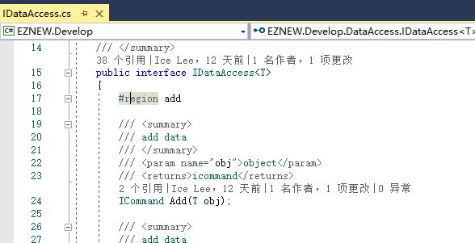

# 操作命令

+ 了解操作命令
+ 命令执行引擎

## 操作命令

首先我们再次看看数据访问接口的定义

发现数据访问中针对数据的操作返回的是一个操作命令（ICommand），也就是说数据访问中的添加，修改，删除等操作并不是立刻执行的，而是将这些操作和操作中需要的数据封装成一条数据执行命令，例如添加命令，修改命令，删除命令等。最后将这些命令交由命令执行器统一执行。

## 命令执行器

命令执行器就是用来负责数据操作命令的具体执行工作的，在[EZNEW.Data]中提供了一个默认的针对关系数据库操作的命令执行器[DBCommandEngine]实现，通常如果是基于数据的数据操作基本上使用默认的就足够了，若是有特殊的命令执行需求也可以基于[ICommandEngine]来实现自己的命令执行器。可以通过配置[CommandExecuteManager]类型的[GetCommandEnginesAsync]属性来自定义具体命令对应的命令执行器规则。

## 总结

命令执行器的属于框架中的一个底层概念，在日常的开发中通常不需要了解，当需要自定义实现的时候可能才需要详细了解它的实现。