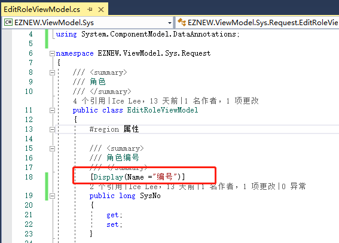
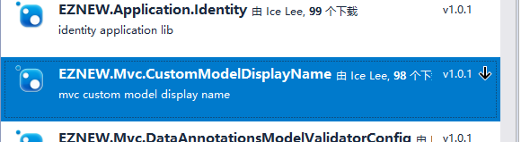
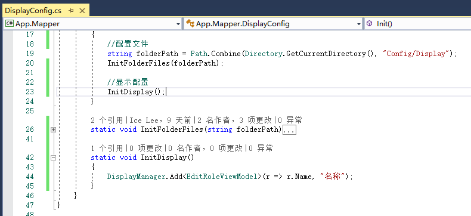
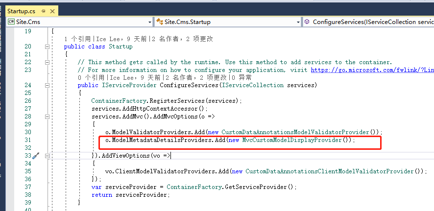
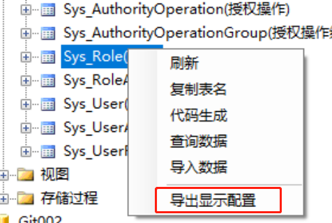

# MVC视图模型显示配置

+ 传统设置方式
+ 编码配置
+ 文件配置

## 传统设置方式

在使用MVC视图模型(ViewModel)的时候，常常会使用 @Html.LabelFor(r) => r.Name)的方式来显示属性的名称，而默认情况下设置显示名称的方式是需要在相应的ViewModel的属性上添加显示修饰属性的[Display],以配置角色的视图模型为例

即使是将相关的信息放到资源文件中也还是需要添加绑定相关的属性配置，这对后期的维护和修改都不是很方便。通过[EZNEW.Mvc.CustomModelDisplayName]可以很方便的的将这些配置信息进行集中管理，最好的方式是直接配置到配置文件中方便后期维护

## 编码配置

1：首先在项目中安装[EZNEW.Mvc.CustomModelDisplayName]包

2：直接配置属性显示

3：应用到MVC

## 配置文件

配置文件方式和我们前面[[数据验证]](datavalidation)配置文件方式相似，Demo中默认的显示配置文件放在应用程序根目录下的Config/Display文件夹或者及其子文件夹下。在EZNEW.Coder中可以两种方式生成显示配置文件：

1：直接从数据表导出显示配置，如果在创建数据库的时候添加了备注信息，这是一种很方便的方法，但要注意这种方式直接导出的文件里面的类型名称和路径可能需要修改。

2：手动配置显示导出，操作方式和[[数据验证]](datavalidation)中配置验证规则类似