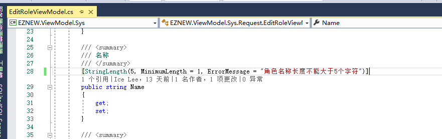
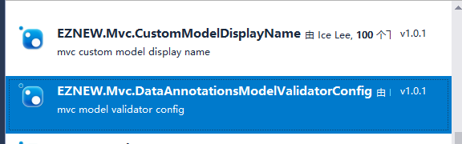
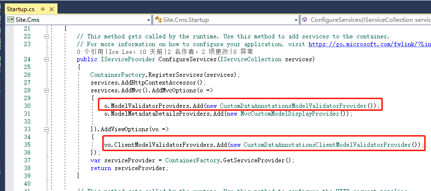

# MVC视图模型验证配置

MVC中为我们提供了便捷的方式来针对ViewModel的数据验证，通常的方式是直接在视图模型的属性上进行验证规则配置

这种硬编码的方式对于开发和后期维护起来都不是很方便，所以在基于EZNEW.NET的[[数据验证]](datavalidation)的功能上提供了可以通过集中配置管理和配置文件的方式来配置验证规则，具体的规则配置方法和[[数据验证]](datavalidation)中的方式一样。这里主要讲一下如何将自定义的数据验证模型应用到MVC框架中

1：在MVC站点中安装[EZNEW.Mvc.DataAnnotationsModelValidatorConfig]包

2：注册验证规则提供程序

这里配置了两个验证提供程序，一个是用于MVC服务端的数据验证，一个是用于MVC在生成前端html控件的时候同时生成相关的js前端验证规则使用的