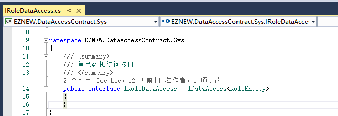
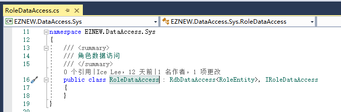

# 数据访问

+ 数据访问结构
+ 默认数据库访问实现

## 数据访问结构

数据访问层的代码就是用来处理实体和数据之间的操作，通常就是最常见的数据添加，修改，查询，删除等基础操作，EZNEW.NET默认规定所有的数据访问都必须继承接口IDataAccess，以角色数据访问为例：

1：声明角色数据访问接口,继承于IDataAccess<RoleEntity>

2：实现角色访问接口

## 默认数据库访问实现

上面我们可以看到，角色的数据访问是直接继承RdbDataAccess，这是框架提供的针对关系数据库数据访问的实现，一般情况下不需要做任何修改就可以直接使用，当需要自定义相关数据操作逻辑时可以重写相关的方法。具体的默认实现可以查看RdbDataAccess实现源码