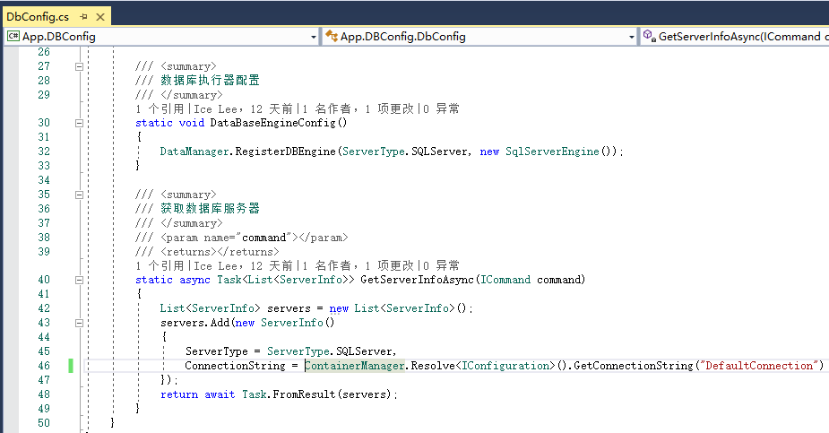

# 数据库操作

+ 数据库信息配置
+ 数据库执行引擎
+ 切换数据库类型

## 数据库信息配置

和数据库操作相关的功能都封装在[EZNEW.Data.XXX]模块中，在应用中我们通常只需要知道如何配置数据库连接信息和注册数据库执行器就行了

可以同时给一条命令指定多个数据库信息，数据操作会分别执行到各个数据库中。

## 数据库执行引擎

前面说过我们的数据操作都是统一的数据执行命令，那要将执行命令转换为特定数据库能执行的执行语句等就需要针对特定的数据实现相应的数据库执行引擎（IDbEngine）就可以了，目前框架中默认提供针对SQLServer（SqlServerEngine）和MySQL（MySqlEngine）两种数据库的执行引擎，后续会再增加对其它数据库的支持。

## 切换数据库

在[[快速开始]](quick-start)已经介绍过如何方便的对系统做数据库迁移，只修改命令的数据库连接类型并注册相应的数据库执行引擎就行，不需要再做其它任何修改。