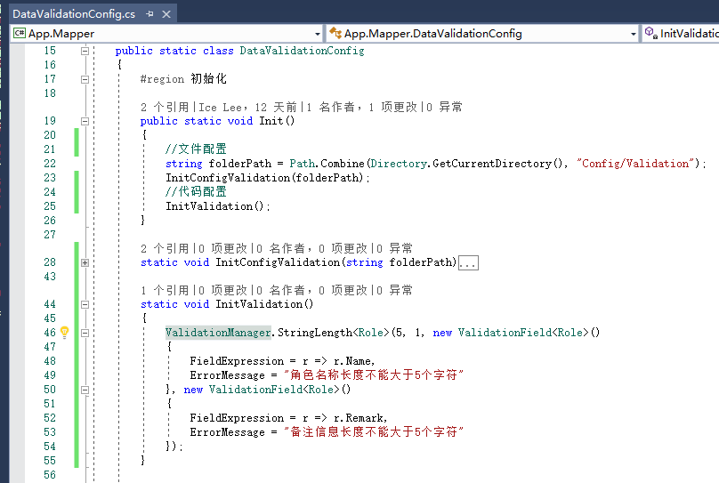
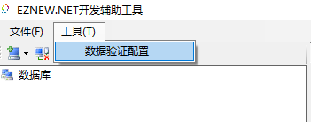
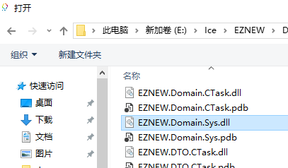
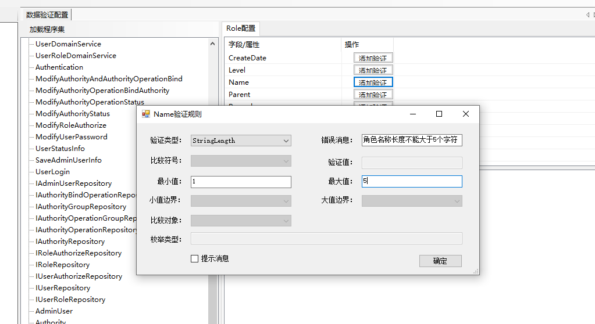
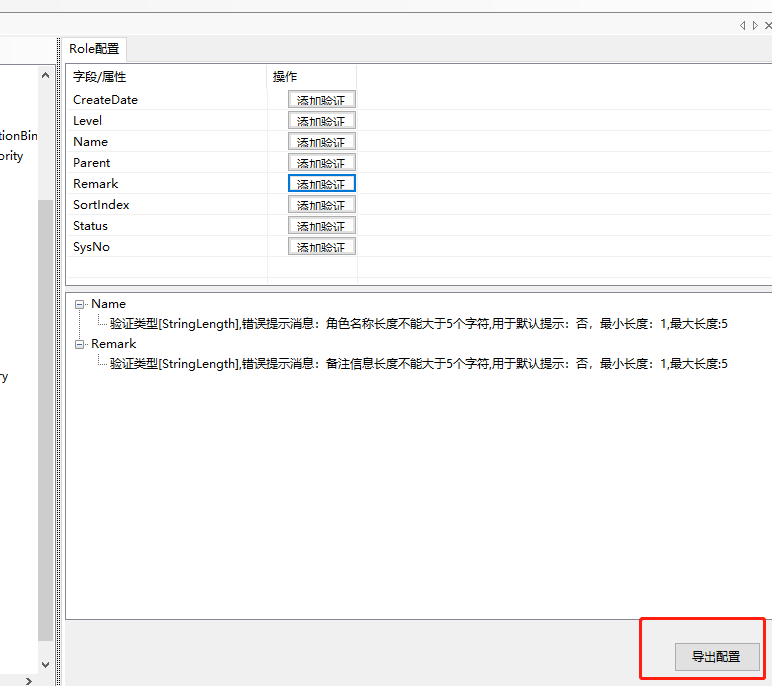
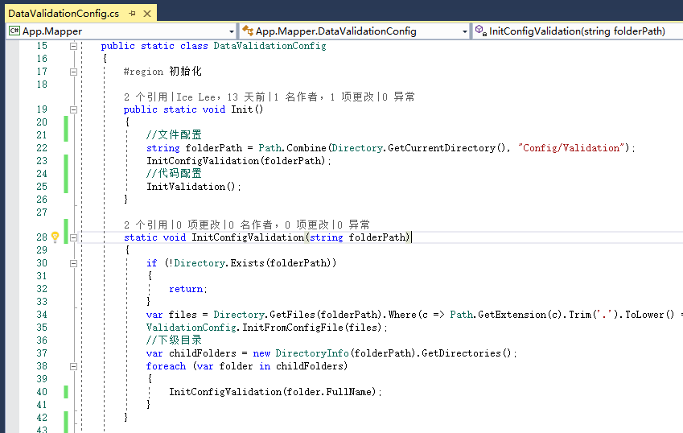

# 数据验证

+ 数据验证功能
+ 配置验证规则
+ 执行验证

## 数据验证功能

在业务系统中对资源对象上的值我们可以会做一些数据验证，以保证保存到系统中数据都是有意义的数据，但是若直接在每个业务的地方都手动添加数据验证判断的话不但会让我们的业务代码臃肿难以维护，而且可能出现遗漏等情况，所以EZNEW.NET提供了一个单独负责数据验证的功能模块，可以方便统一管理数据验证。

## 配置验证规则

目前可以通过两种方式配置数据验证规则：

    + 代码配置
    + 配置文件

1：代码配置

[ValidationManager]中提供了常见的数据验证规则配置方法，若要自定义验证规则可以通过定义正则表达式实现，下面保证通过给角色的名称和备注信息同时加上一条验证规则为例，要求名称和备注不能为空，且不能超过5个字符

2：通过配置文件配置

还可以通过配置文件配置验证规则，借助[[EZNEW.Coder]](https://raw.githubusercontent.com/eznew-net/Demo/master/Tool/EZNEW.Coder.zip)提供的验证生成小工具可以方便的生成验证规则配置文件

1：运行EZNEW.Coder->工具->数据验证配置

2：加载类型

3：选择角色(Role)->右键生成验证

4：添加规则

5：导出配置文件,默认通常放到应用程序下面的Config->Validation文件夹或者子文件夹下

6：应用程序初始化的时候配置读取验证配置文件

## 执行数据验证

若是给领域对象配置了数据验证，则默认不需要开发人员手动去触发验证，当执行数据保存的时候仓储（Repository）会默认调用数据验证程序来执行数据验证。如果需要手动验证数据对象，可以调用ValidationManager.Validate方法来执行数据验证。数据验证不仅仅可以使用在领域对象上，它可以使用到任何需要执行数据验证的类型上面，后面就会看到在基于数据验证模块扩展的如何基于配置文件来来配置MVC视图模型的数据验证，从而避免去代码上硬编码添加验证属性（Attribute）。