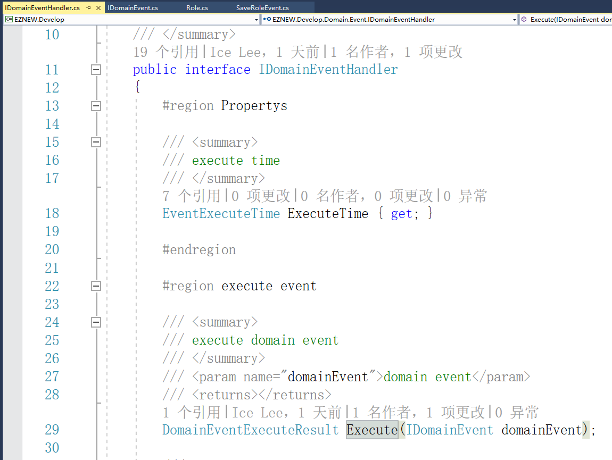

# 领域事件

+ 为什么要使用领域事件
+ 创建领域事件
+ 发布事件
+ 事件处理程序
+ 订阅事件
+ 处理程序覆盖范围
+ 事件覆盖范围

## 为什么要使用领域事件

领域事件用来捕获在业务流程中执行的相关操作或者对象的状态变化，例如当我们在进行某一业务操作的时候可能会引起其它领域的业务操作，触发相关的事件或者修改相关的数据，所以领域事件可以用来维护系统业务和数据的一致性。在传统的开发方式中要执行这一系列的操作，通常是将这些业务操作的代码耦合在一起
依次实现，但是这对于系统的维护和扩展都非常的不利，当需要改变或新增业务操作的触发行为的时候就需要去修改原始业务操作的流程代码，所以通过领域事件的形式还可以很好的对系统进行解耦并保持良好的扩展性。

## 创建领域事件

EZNEW.NET中定义了【IDomainEvent】领域事件接口以及一个抽象的事件基类【BaseDomainEvent】，对于我们自己需要定义的一系列领域事件都可以直接继承该基类，例如定义一个用于捕获保存角色的领域事件【SaveRoleEvent】

## 发布事件

EZNEW.NET中的领域事件使用了一个轻量级的发布-订阅模式，通过【DomainEventBus】来实现事件的发布和订阅，我们已经创建了一个用来表示保存角色的事件【SaveRoleEvent】,在执行角色保存的时候将该事件发布出去

## 事件处理程序

定义了领域事件同时需要定义相应的事件处理程序，EZNEW.NET中定义了事件处理接口【IDomainEventHandler】，也就是所有自定义的事件处理程序都必须实现该接口

接口定义了一个属性【ExecuteTime】和一个执行入口方法【Execute】，ExecuteTime是一个枚举值类型，表示处理程序执行的时机

    - Immediately：立即执行，也就是在事件发布后立即捕获然后执行事件处理程序
    - WorkCompleted：工作单元成功提交后执行

例如定义一个事件处理程序【RoleSavedThenSendEmail】用来捕获角色保存操作并发送邮件，当然这里只是模拟事件处理流程，并不会真的发送邮件。

## 订阅事件

定义好事件处理程序后就可以订阅该事件，这样在发送角色保存行为的时候就会触发该事件并执行处理程序

这样我们就可以通过配置订阅不同的事件处理行为来捕获处理【SaveRoleEvent】,除了自定义事件处理程序外，还可以通过直接订阅相应的事件处理方法来快速的完成对事件的捕获，例如当执行角色保存行为的时候记录日志。

这操作是在保存角色行为的时候立即执行的，而发送邮件操作是在工作单元将所有工作成功提交执行以后再执行的，当然也可以通过参数控制订阅操作执行的时间，默认是立即执行。

## 处理程序覆盖范围

在前面订阅事件的时候使用的是【GlobalSubscribe】方法，DomainEventBus提供了两种订阅方法

    - GlobalSubscribe：全局订阅，也就是针对整个应用程序，在整个应用程序中只要触发了相应的订阅事件就会
                       执行相应的处理程序，通常用于应用程序固定的业务流程
    - WorkSubscribe：工作单元内订阅，它的订阅范围只针对一个特定工作单元管理的工作区域，是在工作单元
                     创建以后再进行订阅配置的，通常是用于在某一次操作中有特殊业务需求的时候才会配置

## 事件覆盖范围

通常在执行事件订阅的时候都会显示指定事件的类型，也就是调用【GlobalSubscribe<Event\>】和【WorkSubscribe<Event\>】的泛型方法执行订阅的事件类型，当某些场景需要一个处理程序订阅系统中发生的所有领域事件的时候可以使用的它们的非泛型形式实现，也就是不指定事件类型，这样系统运行中触发的
任何领域事件都会被该订阅的处理程序捕获处理。