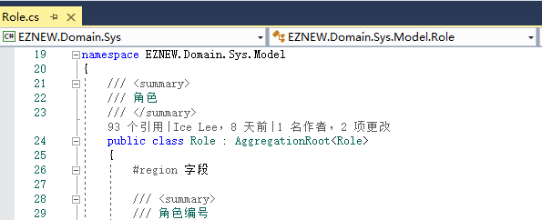
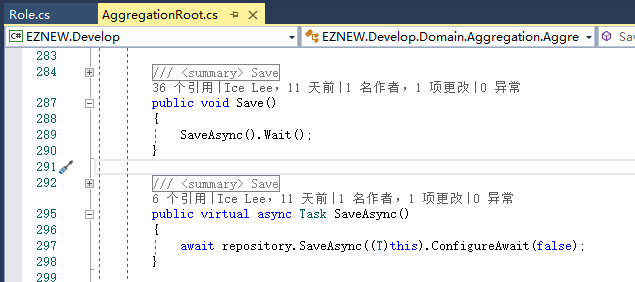
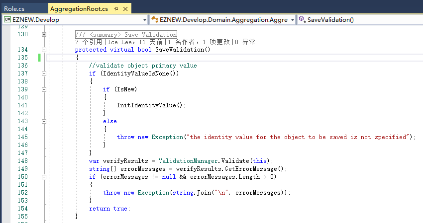
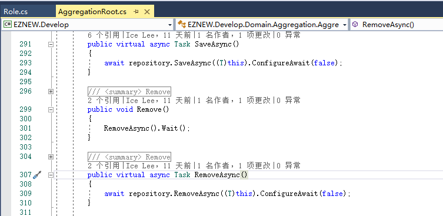
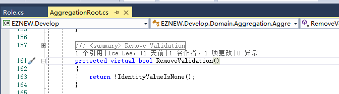
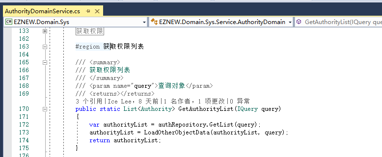
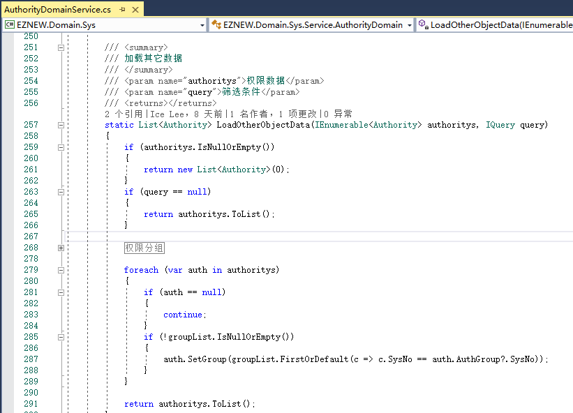

# 领域对象

+ 了解领域对象
+ 了解领域对象基类的结构
+ 了解常用属性和方法的使用
+ 重写常见的方法

## 领域对象

领域驱动开发中领域对象是一个核心的概念，因为不管是从系统的分析，设计，还是开发实质上都是围绕领域模型展开的，所以良好的领域对象设计是系统可用性，扩展性，维护性等等的基础。这里并不是讨论如何去设计领域对象，因为这是和具体的系统业务高度相关的话题，我们主要来学习在EZNEW.NET中针对领域对象提供的一些基本的操作。

## 领域对象基类(AggregationRoot<T\>)

在EZNEW.NET中AggregationRoot<T>是所有领域对象的基类，也就是说系统中建立的所有领域对象都要派生字该类型，该类型提供了一些常用的默认属性和方法。

## 保存

AggregationRoot<T\>提供了两个对象保存的方法(同步和异步方法)和默认的实现逻辑，直接调用对象的资源存储来保存对象，大部分情况下默认实现就可以满足我们的日常业务需求，当需要自定义保存逻辑的时候可以通过重写[SaveAsync]方法来实现。

和保存相关的还提供了一个数据验证方法[SaveValidation],它会在资源存储(repository)执行对象保存的时候用于验证对象是否能保存，默认实现中主要做了两方面的数据验证

    1：对象标识值验证
    2：通过数据验证器验证对象的数据合法性（关于数据的验证后续会有专题文章进行讲解）

## 移除

AggregationRoot<T\>提供了两个对象移除的方法(同步和异步方法)和默认的实现逻辑，使用上和保存方法类似。

同样的也提供一个在移除对象时进行的数据验证方法[RemoveValidation]

## 数据加载

在讲查询表达式的时候接触到了数据延迟加载的概念，AggregationRoot<T\>提供了几个和数据加载相关的几个属性和方法

| 方法/属性 | 说明 |
| ------ | ------ |
| LoadLazyMember | 指示当前对象是否允许使用延迟加载功能，相当于开启数据加载功能的总开关 |
| LoadPropertys | 当前对象设置的需要数据加载属性信息，可以通过对象设置，也可以通过查询表达式设置 |
| SetLoadPropertys | 设置数据加载属性，功能和查询表达式设置相同 |
| CloseLazyMemberLoad | 关闭对象数据加载功能 |
| OpenLazyMemberLoad | 打开对象数据加载功能 |
| AllowLazyLoad | 判断指定的属性是否允许加载数据 |

所以默认判断一个对象的属性是否允许执行数据加载需要满足两个条件：

    1：保存对象启用了数据加载功能（LoadLazyMember）
    2：显示设置了需要加载数据的属性（LoadPropertys）

这里要特别注意属性LoadLazyMember，它的默认值和获取数据的方式有一定的关系

    + 如果对象是通过调用获取单个对象查询方法获取出来的话默认是打开的
    + 如果对象是通过批量查询的方式返回的话默认是关闭的（通常所谓的批量
      返回就是通过列表或者分页的方式查询的数据，这一点主要是出于对程序
      性能的考虑，防止大量数据同时触发数据加载）

针对批量返回的数据如果需要执行数据加载通常是集中批量处理，例如获取权限的时候需要同时获取对应的分组信息

## 对象状态

对象状态就是表示领域对象在对象资源状态管理中的生命状态，在执行对象操作，例如保存和移除的时候会根据对象的状态来判断执行具体的什么样的操作。对象的状态通常分类两种[New]和[Stored],也就是指示对象是新创建的还是已经保存过的对象,对象状态通常由系统自行维护，不需要开发人员设置，但是在特殊的场景下可能需要手动切换对象的状态来完成的具体的业务。

| 方法/属性 | 说明 |
| ------ | ------ |
| IsNew | 判断对象状态时候为[New] |
| MarkNew | 将对象标记为[New]状态 |
| MarkStored | 将对象标记为[Stored]状态 |

## 对象标识

一般来说每一个领域对象都有一个标识值来标记它的唯一性（类似数据库的主键）,默认情况下若不自定义返回标识值，系统会使用一个默认的标识值，当然最好的情况是还是返回业务对象中更有意义的真实标识值。

| 方法/属性 | 说明 |
| ------ | ------ |
| IdentityValue | 对象标识值 |
| InitIdentityValue | 初始化标识值 |
| IdentityValueIsNone | 判断对象标识值是否无效 |
| GetIdentityValue | 获取对象标识值 |

## 总结

本篇教程介绍了默认领域基类中定义和实现的相关属性和方法以及它们的功能，要充分了解它们各自实现的具体功能才能决定在什么时候进行重写或者自定义实现以满足系统的业务需求。