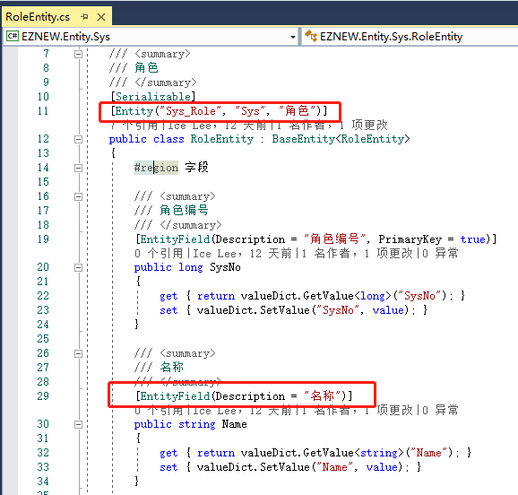

# 实体对象

+ 实体概念
+ 实体基类
+ 实体配置

## 实体

实体对象通常用于数据的持久化，一般情况下所谓的持久化就是将数据保存到数据库或者文件，所以要将系统中的业务数据持久化保存最终是转换成实体对象进行保存的，也就是说实体的数据结构和我们数据源中存放的数据结构基本上是保持一致的。实体对象基本上只是用于作为数据的载体，并不会包含任何业务功能。

## 实体基类

EZNEW.NET中规定所有的实体都继承于BaseEntity<T>,实体类创建好以后平时基本上没有什么额外的功能，所以主要是了解它的基本结构，这个可以参考Demo中的实体类型。

## 实体配置

因为实体类通常是用于和数据库直接打交道的，那通常就需要给实体配置一些和数据库相关的信息，框架中提供了三种方式来对实体进行配置：

    + 属性修饰（默认方式）
    + 配置方法
    + 配置文件

1：属性修饰

以[RoleEntity]为例

针对实体类使用[Entity]来进行修饰，这个类型比较简单，主要是配置实体对应要操作的对象名称（ObjectName），通常对应的就是关系数据库的表名。

实体类的属性通过[EntityField]属性进行修饰，它提供了一些常用的属性来指定实体属性的功能：

| 属性 | 说明 |
| ------ | ------ |
| Name | 数据库字段名，若数据库字段和属性名称不一致需要显示指定 |
| PrimaryKey | 是否为主键 |
| DisableQuery | 查询的时候不查询该字段 |
| DisableEdit | 添加/修改的时候不设置该字段 |
| IsVersion | 是否为版本号字段，若数据需要一个版本表示字段，那推荐将版本字段设置为数据类型，这样就不需要手动干涉版本信息，框架会自动维护版本信息，操作数据的时候也会自动进行版本比对 |
| RefreshDate | 是否为更新时间字段，在某些数据结构中可能需要一个时间字段来记录数据的最新操作时间，可以使用该属性指定后就可以不需要手动去维护这个更新时间，在对数据进行操作的时候框架会自动维护它的值 |
| QueryFormat | 查询的时候进行格式化，这个属性很少使用，通常是一些特殊类型的数据不能直接进行查询，需要调用数据库相关函数进行转换输出的时候 |

通过开发辅组工具生成的代码默认都会加上修饰属性，通常不需要自己再进行配置。

2：配置方法

在[EntityManager]中提供了一些列的配置方法来配置上面修改属性中的值，要注意，配置方法的优先级>修饰属性，通常直接使用修饰属性就可以满足大部分情况下的需求了，只有在少数需要动态配置的情况下需要使用配置方法。

3：配置文件

目前没有提供默认的配置文件示例，若真正需要通过配置文件来进行配置，基于前面提供的配置方法开发人员自己也可以实现，后续会补充通过文件配置的功能。