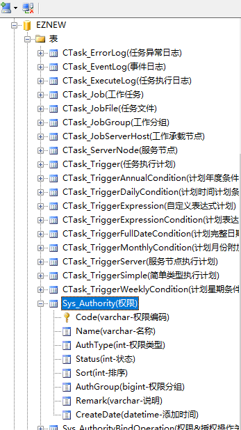

# 开发辅助工具

[[下载]](https://raw.githubusercontent.com/eznew-net/Docs/master/Tool/EZNEW.Coder.zip)

辅助工具只是提供一些简单小的工具来辅助开发人员，提高开发效率，很多内容可能通过工具生成出来并不能直接使用，需要进行进一步修改，主要来了解提供的一些常用的一些功能

## 数据库相关

1：查看数据库结构，目前支持连接SQL Server,MySQL,Oracle三种数据库，可以查看数据库中的表，视图，存储过程的基本结构和信息

2：数据库节点功能
    
    + 创建查询窗口，可以用来执行一些简单的SQL语句来管理数据库
    + 导出数据库结构，将数据库的所有表结构导出到一个Excel文件中
    + 基于当前数据库创建新的项目

3：数据表功能

    + 生成代码，根据数据表生成常用的项目代码
    + 导入数据，提供将Excel数据快速导入的数据表
    + 导出显示配置

## 工具栏

1：文件

    + 创建项目
    + 创建项目中的功能模块
    + 配置代码生成选项

2：工具

    + 数据验证规则生成
    + 数据显示生成

