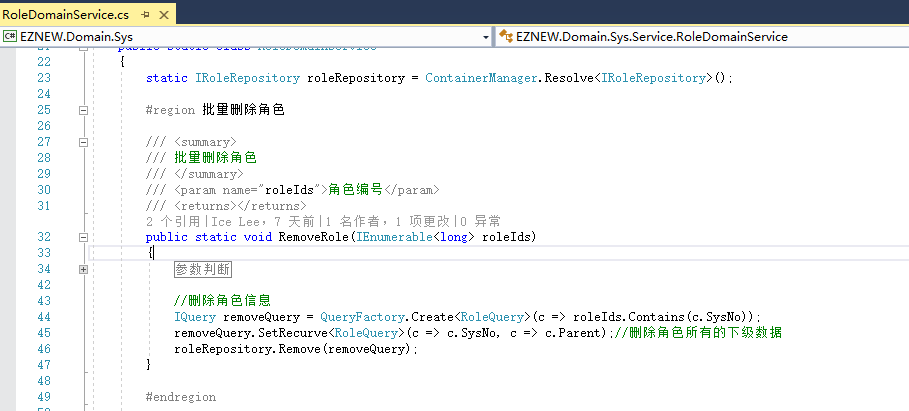

# 查询表达式

+ 了解查询表达式和查询对象概念
+ 熟悉查询表达式的各种使用方法
+ 查询表达式的各种注意事项

## 查询表达式

查询表达式（也可以称为条件表达式）顾名思义就是用来封装设置数据操作的查询条件，例如在进行数据查询，修改，删除等相关操作时进行查询条件的设置，当然在实际使用中它实际的作用不单单是用来设置查询条件，它可能还会携带一些其它的额外信息或作一些其它的工作，比如查询数据的时候还可以设置排序条件，查询字段等等。除了提供常规的条件设置以外它还提供了几种复杂条件设置来方便我们日常功能的开发。

## 查询对象

查询对象在我们前面的基础操作教程里面已经接触过了（角色的查询对象RoleQuery）,它的功能相对来说其实很简单，大部分情况下就是在使用查询表达式的时候方便我们引用相关的字段和属性，它通常是和我们的实体对象相关联的（属性名字几乎和实体一样，当然碰到复杂的查询的时候也可以进行自定义修改），也就是说几乎一个实体对象就对应有一个查询对象。

## 创建查询

查询表达式都是通过QueryFactory类型的Create方法创建

它提供了如下几种重载实现，通常情况下建议都尽量使用泛型的实现，泛型参数是一个查询对象类型，因为首先这样可以方便我们在创建表达式的时候就可以设置条件，更重要的是在后续讲的几种复杂的查询中的某些情况下是必须要求查询表达式绑定查询对象的，当然如果只是正常使用简单的查询的话也可以使用非泛型的实现效果是一样的

| 方法 | 说明 | 示例 |
| ------ | ------ | ------ |
| Create() | 创建一个默认的查询表达式 | var query = QueryFactory.Create(); |
| Create(PagingFilter filter) | 使用一个分页参数创建查询表达式 | var query = QueryFactory.Create(filter); |
| Create<T\>() | 通过一个查询对象创建表达式 | var query = QueryFactory.Create<RoleQuery\>(); |
| Create<T\>(PagingFilter filter) | 通过一个查询对象和分页参数创建表达式 | var query = QueryFactory.Create<RoleQuery\>(filter); |
| Create<T\>(Expression<Func<T, bool>> criteria) | 创建表达式，并可以通过Lambda表达式设置查询条件 | var query = QueryFactory.Create<RoleQuery\>(r=>r.Level==1&&r.Parent>0); |

## 条件设置

给表达式设置查询条件主要有两种方式，1：创建的时候通过Lambda表达式设置，2：通过表达式方法设置，当然通过方法设置条件通常也支持两种参数形式，直接参数赋值和Lambda表达式的方式，下面我们就列举几种场景来看看查询条件的具体设置方法，当然查询表达式提供的条件设置方法有很多，我们这里只是举例说明几种常用的，其它的使用方式都是一样的

1： 查询名称为'管理员'的角色

| 方式 | 实现|
| ------ | ------ |
| 表达式 | var roleQuery=QueryFactory.Create<RoleQuery\>(r=>r.Name=="管理员") |
| 条件方法 | var roleQuery=QueryFactory.Create();  //第一种方式 roleQuery.Equal<RoleQuery\>(r => r.Name, "管理员"); //第二种方式  roleQuery.Equal("Name", "管理员");  //第三种方式 roleQuery.And<RoleQuery\>(r=>r.Name=="管理员") //第四种方式  roleQuery.And<RoleQuery\>(r => r.Name, CriteriaOperator.Equal, "管理员");  //第五种方式 roleQuery.And("Name", CriteriaOperator.Equal, "管理员");

2：查询等级大于1并且排序小于5的角色

| 方式 | 实现|
| ------ | ------ |
| 表达式 | var roleQuery=QueryFactory.Create<RoleQuery\>(r=>r.Level>1&&r.Sort<5) |
| 条件方法 | var roleQuery=QueryFactory.Create();  //第一种方式 roleQuery.And<RoleQuery\>(r=>r.Level>1&&r.Sort<5); //第二种方式  roleQuery.And<RoleQuery\>(r=>r.Level>1); roleQuery.And<RoleQuery\>(r=>r.Sort<5); //第三种方式 roleQuery.GreaterThan<RoleQuery\>(r => r.Level, 1); roleQuery.LessThan<RoleQuery>(r => r.Sort, 5); //第四种方式  roleQuery.And<RoleQuery\>(r => r.Level, CriteriaOperator.GreaterThan, 1); roleQuery.And<RoleQuery\>(r => r.Sort, CriteriaOperator.LessThan, 5);

3：查询编号为(1,2,3)的角色

| 方式 | 实现|
| ------ | ------ |
| 表达式 | var roleIds=new List<long\>(){1,2,3}; var roleQuery=QueryFactory.Create<RoleQuery\>(r=>roleIds.Contains(r.SysNo)) |
| 条件方法 | var roleIds=new List<long\>(){1,2,3}; var roleQuery=QueryFactory.Create();  //第一种方式 roleQuery.In<RoleQuery\>(r => r.SysNo, ids); //第二种方式 roleQuery.And<RoleQuery\>(r=>roleIds.Contains(r.SysNo)) //第三种方式  roleQuery.And<RoleQuery\>(r => r.SysNo, CriteriaOperator.In, roleIds);  

上面演示几种基本的条件设置方式，其它的运算符的条件设置使用方式上都是一样的

## 条件分组

分组条件就是意味着有一些相对独立的几组条件同时存在的情况，例如查询Level等于1 或者 名字为“管理员”且排序为1的角色，通常的sql实现形式为：select * from Role where Level= or (Name='管理员' and Sort=1); 那我们看一下涉及到这种分组的条件如何来实现

| 方式 | 实现|
| ------ | ------ |
| 表达式 | var roleQuery=QueryFactory.Create<RoleQuery\>(r=>r.Level==1\|\|(r.Name=="管理员"&&r.Sort==1)) |
| 条件方法 | var roleQuery=QueryFactory.Create();  //第一种方式 roleQuery.And<RoleQuery\>(r=>r.Level==1\|\|(r.Name=="管理员"&&r.Sort==1)); //第二种方式 roleQuery.And<RoleQuery\>(r=>r.Level==1) roleQuery.Or<RoleQuery\>(r=>r.Name=="管理员"&&r.Sort==1) //第三种方式  roleQuery.And<RoleQuery\>(r => r.Level==1); var groupQuery = QueryFactory.Create<RoleQuery\>(r=>r.Name=="管理员"&&r.Sort==1); roleQuery.Or(groupQuery);  

所以可以发现，查询表达式对象除了用来封装正常的条件以外，还可以用来作为条件的分组进行嵌套，这在我们某些复杂的查询场景是非常有用了，通过组合不同的表达式对象可以灵活的构建我们的查询条件

## 子查询

子查询是我们在关系数据库里面的一个查询概念，通常是发生在一个查询中需要跨越多张数据表的时候，查询表达式同样提供了对子查询的支持。 查询用户编号等于1的用户绑定的角色信息

var userQuery = QueryFactory.Create<UserRoleQuery>(ur => ur.UserSysNo == 1);//用户&角色关系查询 
userQuery.AddQueryFields<UserRoleQuery>(ur => ur.RoleSysNo);//设置查询字段属性 
var roleQuery = QueryFactory.Create<RoleQuery>();//创建角色查询表达式 
roleQuery.In<RoleQuery>(r => r.SysNo, userQuery);//设置查询条件，角色编号的参数值是通过一个子查询得出来的

要特别的注意的是作为条件的子查询表达式必须要设置用作关联的字段属性值，子查询同样可以灵活的嵌套来提供更复杂的查询要求。同时要特别注意通过包含子查询的表达式操作数据，例如删除或者修改可能会破坏框架内部的对象资源状态管理，因为这实质上并不是严格意义上的针对对象的处理。

## 递归查询

递归查询同样是直接和数据库相关联的一个概念，通常用在树形结构的数据操作中，例如我们示例中的角色信息就是按一种常规典型的方式设计的树形结构数据，在涉及到对这一种特殊结构的数据操作中可能会影响到数据的上下级，当然在尽可能允许的情况下还是推荐通过业务代码来实现递归的业务逻辑来直接操作上下级对象数据，但是在某些情况下为了程序开发的便利性就可以使用递归查询的特性来简化我们的开发。

例如在删除角色数据的时候通常需要同时删除它的所有下级角色，这个时候最简便的方法就是使用递归查询表达式来实现

这种方式也可以使用在数据查询的时候，例如要查询某个角色及其所有的下级角色的时候也可以使用递归查询实现。

设置递归查询的方法有参数，第一个通常是主键值，第二个是上下相关联的键值，第三个参数是指定递归查询的方向，通常来说就是指明是从下级向上级查询还是从上级向下级查询，例如我们也可以在查询一个下级角色的时候同时查询出它的所有上级角色。

## 分页查询

## 设置排序

## 设置查询字段

## 注意事项

## 总结