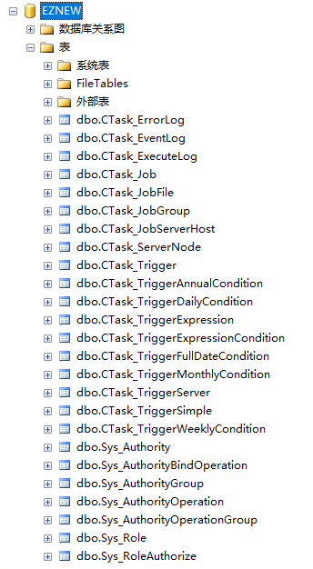
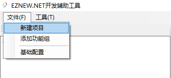
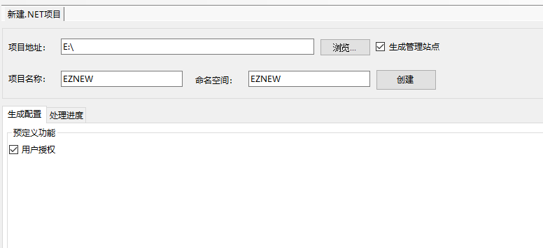
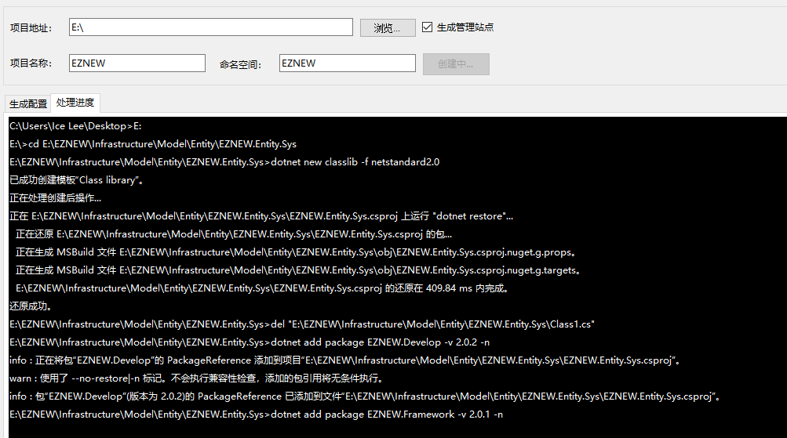
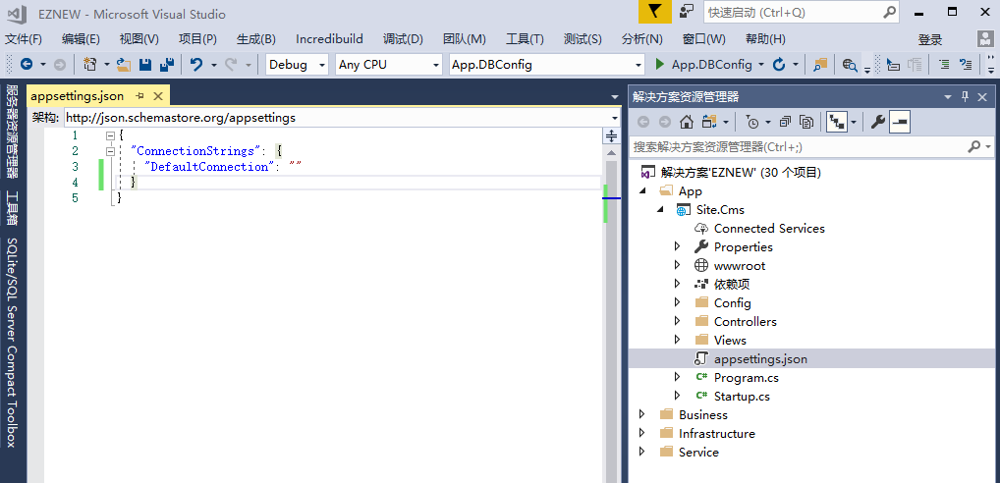
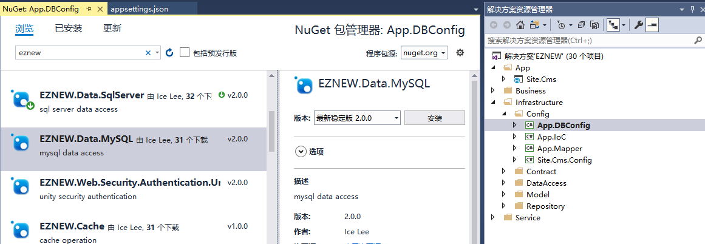
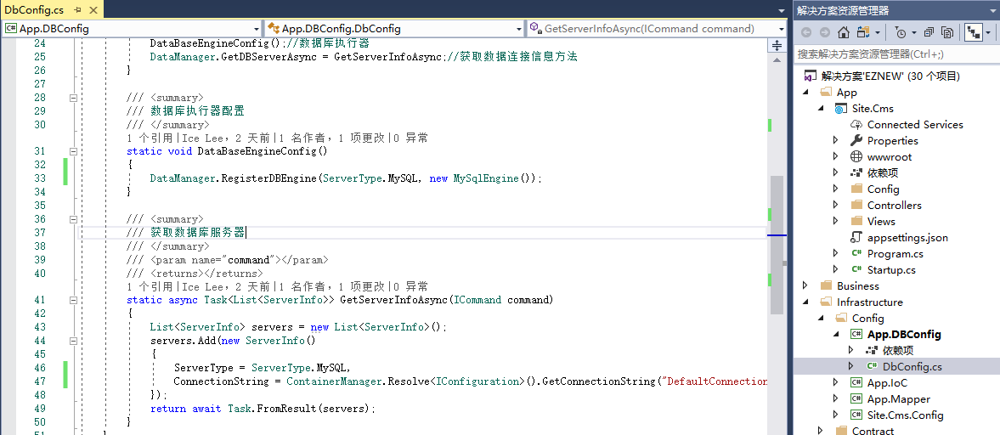
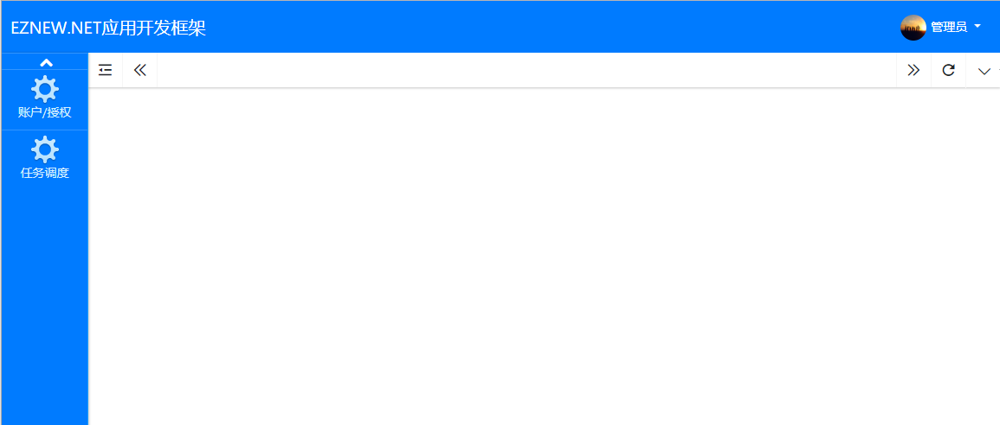

# 快速开始

## 环境准备

1. 推荐开发环境:VS2017+.NET Core 2.2

1. 获取 [EZNEW.NET开发辅助工具](https://raw.githubusercontent.com/eznew-net/Demo/master/Tool/EZNEW.Coder.exe)

1. 下载示例数据库脚本，目前支持 [SQLServer](https://github.com/eznew-net/Demo/blob/master/Tool/DB/sqlserver.sql) 和 [MySQL](https://github.com/eznew-net/Demo/blob/master/Tool/DB/mysql.sql) 两种数据库。

1. 所使用到的框架功能Nuget包已全部发布到 [nuget.org](https://www.nuget.org/packages?q=EZNEW)，可以直接使用。

## 创建数据库

通过上面创建数据脚本创建示例数据库，可以任选SQLServer或者MySQL，这里以SQLServer为例，创建一个EZNEW的数据库。

## 创建项目

可以通过两种途径得到一个测试项目（注意：不管使用以下那种方式得到项目代码都是以演示框架功能为目的而创建，不能直接应用到实际开发中去）

一：下载 [示例项目](https://github.com/eznew-net/Demo)，该项目包含了后续教程中使用到的完整范例，后续框架的所有功能讲解演示都是基于该示例项目，项目模拟了两个主要的业务场景

    1：用户角色及权限管理
    2：调度任务管理

二：通过辅助工具创建项目
    
    1：直接新建项目，打开辅助工具->文件->新建项目

    2：选择项目存放路径，填写项目名称和命名空间，例如新建一个EZNEW的项目

    3：点击创建开始创建项目，创建项目需要花费一点时间，具体取决于计算机性能

    4：项目创建完成后配置数据库连接字符串

    5：若要使用MySQL数据库(SQLServer忽略)，首先给项目 [App.DBConfig] 安装包 [EZNEW.Data.MySQL],
       然后修改数据库配置

    6：编译运行项目

## 项目结构
