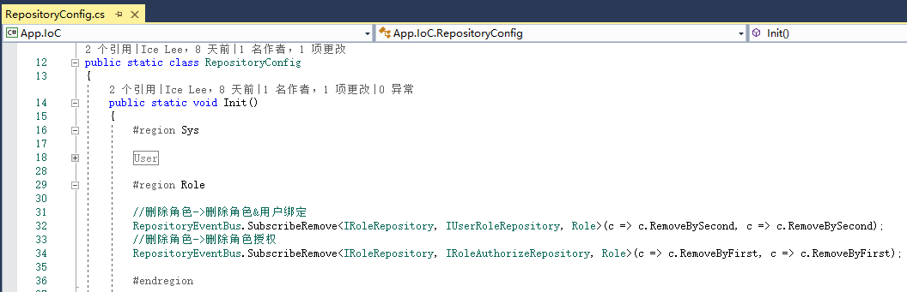
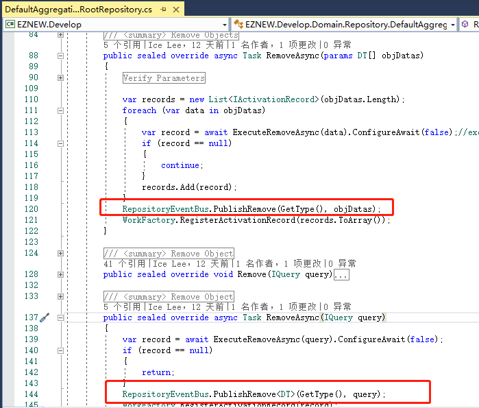

# 资源仓储

+ 了解仓储的功能
+ 默认仓储模式的使用
+ 聚合函数
+ 仓储事件

## 资源仓储

仓储的功能主要就是用于对领域对象的存储管理，对象和仓储的关系可以很好的用现实中物品和仓库的关系作为类比，仓库负责物品的存放管理操作，对各种不同的种类的物品管理存放的方式也是不一样的，所以针对系统中不同性质，结构的数据对象都要使用合适的仓储模式来负责对象的存储管理。虽然仓储是负责领域对象的存储，但是在现实的系统开发中数据通常最后是会持久化到数据库的，所以仓储在实际开发中也扮演着业务对象转移到数据实体进行数据操作的桥梁。

## 仓储模式

业务对象的数据类型，结构决定了应该使用什么样的仓储模式来管理对象的存储，框架中总结实现了几种常见的仓储模式来满足开发中常见的业务场景，当然在实际开发中也可以根据自己的需求自定义仓储实现。

| 仓储接口 | 默认实现 | 说明 |
| ------ | ------ | ------ |
| IAggregationRepository | DefaultAggregationRepository | 默认领域对象仓储模式，也是使用最广泛的模式,参考:IRoleRepository->RoleRepository |
| IRelationRepository | DefaultRelationRepository | 关系结构数据仓储模式，参考：IUserRoleRepository->UserRoleRepository |
| IAggregationRelationRepository | DefaultAggregationRelationRepository | 关系结构领域对象仓储模式，参考：IUserAuthorizeRepository->UserAuthorizeRepository |
| IThreeRelationRepository | DefaultThreeRelationRepository| 三者关系结构数据仓储模式，使用方式类似于IRelationRepository模式 |
| IAggregationThreeRelationRepository | DefaultAggregationThreeRelationRepository| 三者关系结构领域对象仓储模式，使用方式类似于IAggregationRelationRepository模式 |

## 仓储事件

仓储的主要工作是在设计和使用上面，除了默认通用的实现模式外，可能还会根据业务需要自己去自定义实现，例如参考示例中的和[TriggerCondition]相关的仓储实现就是在已有的基础了进行了自定义扩展。

## 聚合函数

默认仓储除了提供领域对象的操作方法以外，为了适应日常开发的需要还提供几个常用聚合函数的封装来方便我们的开发，提供的聚合函数有：
    + Count：获取符合条件的数据量
    + Max：求最大值
    + Min：求最小值
    + Sum：求和
    + Avg：求平均值
    

## 仓储事件

注意，这里说的是仓储事件的概念，并非领域驱动里面领域事件的概念,领域事件通常是和领域业务相关的业务事件，而所谓仓储事件就是在资源仓储中对对象资源进行操作的时候，例如保存，删除，查询时需要触发相关的事件来执行额外的操作。举个例子，在Demo应用程序中，[角色]和[用户],[权限]都有绑定关系，那我们希望在删除角色信息的时候也删除它和用户还有权限之间的关系映射，这时候我们通常就会在执行角色删除时触发一个相应的删除事件来执行相关的操作。EZNEW.NET中的的仓储事件通过一个简单的发布订阅的模式来实现。主要通过[RepositoryEventBus]来提供事件的订阅和发布功能，下面以角色相关的仓储事件为例：

    1：订阅角色仓储事件，Demo中的事件订阅是通过应用程序启动时通过在[RepositoryConfig]中进行操作的

    
    2：在执行角色删除的时候发布相关的事件，RoleRepository默认继承与DefaultAggregationRepository实现，
       所以如果是使用上面提到的几种默认仓储实现的操作时已默认实现了事件的发布，除非是在一些自定义实现
       仓储的情况下可能需要自己自定义发布事件

除了上面演示的删除操作，仓储中的任何关于对象的操作都可以注册相关监听事件，详细参考使用可以参考[RepositoryConfig]中各仓储订阅的详细事件

## 总结

本篇教程主要介绍了和资源仓储的相关概念以及默认实现的几种仓储模式，这一部分更详细的使用最好是参考实际的使用示例，同时也要思考怎样针对自己的资源对象设计一个更合理的仓储实现，因为不合理的的仓储实现就会直接影响到领域对象和相关业务逻辑的设计和实现。
