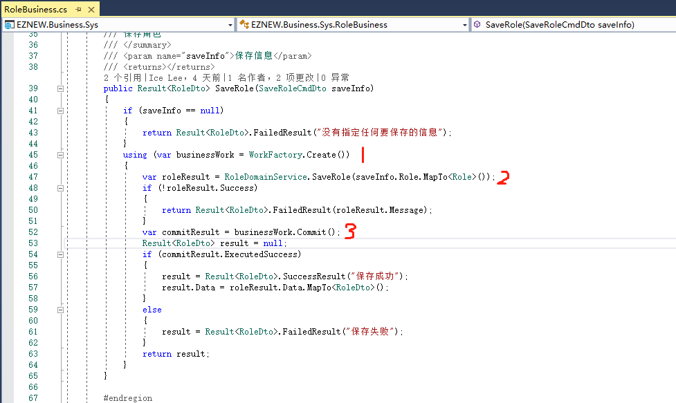

# 工作单元

+ 了解工作单元概念
+ 熟悉工作单元的使用
+ 资源对象状态管理
+ 工作提交

## 工作单元

关于工作单元的概念在《企业应用架构模式》或者其它面向对象开发的书籍里面都有详细的解释，简单来说就是用来管理一个完整的业务工作中里面所有和业务相关的内容，例如在这段范围内发生的所有操作记录，各种资源维护，工作提交等等一些列工作,也就是充当了一个管家婆的角色。有了统一工作管理模式就不需要开发人员在自己的业务代码中去关心这些琐碎的工作，只需要专注与具体业务代码的编写就行了。

## 工作单元使用

在前面的[[基本操作]](basicoperation)中我们已经接触到了工作单元的基本使用



所以可以看出工作单元的使用通常包含3各大的步骤：
    
    1：开启一个工作单元（WorkFactory.Create()）
    2：执行业务逻辑
    3：工作提交返回（Commit）

所以我们可以看到工作单元管理的范围是从创建它后到提交工作的时候之间的所有代码段，也就是说在这个范围以外工作单元是不会维护工作内容的，所以通常的建议是使用一个using语句块显示定义一个工作范围，这样既可以清晰的定义一个工作区间同时也避免了对工作单元手动管理，例如对象的释放清理等工作。

## 资源对象状态管理

工作单元模式中一个非常重要的功能就是资源的状态管理，也就是说针对在工作区间中的操作过的所有资源对象都会跟踪管理对象上的值，状态等信息直到工作提交（commit）以后才会释放所有的状态管理信息。下面通过几种业务操作场景来简单说明状态管理的作用(通过伪代码来加以说明)。

1：添加一个新角色
```C#

using(var businessWork=WorkFactory.Create())
{
    //1:添加一个编号为123的新角色
    var newRole=Role.Create(123);
    newRole.Save();//这个地方只是执行对象的保存，并不会持久化到数据库
    
    //2：获取编号为123的角色
    var role=RoleDomainService.GetRole(123);
    //这里可以取出我们新添加的数据，即使当前数据库还没有该数据，实际上我们已经执行了保存操作

    //3：提交，将数据持久化到数据库
    businessWork.Commit();
}
//这个地方已经属于工作单元管理范围以外，是否能取出值取决于上面的工作有没有真正提交(commit)成功
var role=RoleDomainService.GetRole(123);

```

2：修改角色

假设当前已存在一个编号为111的角色

```C#

using(var businessWork=WorkFactory.Create())
{
    //1：获取角色
    var role=RoleDomainService.GetRole(111);
    
    //2：修改名称并保存
    role.Name="新名称";
    role.Save();//保存

    //3：再次重新获取角色
    role=RoleDomainService.GetRole(111);
    var name=role.Name;//获取的角色名称为刚刚修改的名称，即使当前数据库中的信息并未更新

    //4：提交，将数据持久化到数据库
    businessWork.Commit();
}
//这个地方已经属于工作单元管理范围以外，取出的角色名称取决于上面的工作有没有真正提交(commit)成功
var role=RoleDomainService.GetRole(111);
var name=role.Name;

```

3：删除角色

假设当前已存在一个编号为111的角色

```C#
using(var businessWork=WorkFactory.Create())
{
    //1：删除角色
    var removeQuery=QueryFactory.Create<RoleQuery>(r=>r.SysNo==111);
    RoleDomainService.Remove(removeQuery);

    //3：获取角色
    role=RoleDomainService.GetRole(111);
    //当前已经不能获取到指定的角色，即使数据库的角色数据依然存在

    //4：提交，将数据持久化到数据库
    businessWork.Commit();
}
//这个地方已经属于工作单元管理范围以外，是否能取出角色取决于上面的工作有没有真正提交(commit)成功
var role=RoleDomainService.GetRole(111);

```

通过上面的的几个简单例子大家可以简单体会一下对象状态管理的基本作用，可以把它理解为一个对象的本地仓库，会跟踪管理业务操作中对对象的一系列操作和修改，只有在工作真正提交以后才会将这些更改持久化到数据库。这里大家一定要特别注意一点就是这个对象状态管理的本质并不是扮演数据缓存的角色，例如上面的第二个修改角色的例子，在第二次获取数据的时候实质上还是会正常访问数据库获取数据，只是在获取数据后对象状态管理机制会处理相关的值和状态，返回最新的业务处理结果给我们，同时这里再次强调在前面在查询表达式中提到过的两个特殊情况，当通过条件去执行数据操作，且查询表达式中含有子查询和递归的特殊条件的时候可能会破坏状态管理机制，在使用的时候要特别注意。


## 工作提交

通过前面的示例可知，在执行完所有业务工作以后一定要进行提交，不然的话实质上相当于没有做任何工作，只有在提交工作以后相关数据的更改才会持久化到数据库中，关于提交返回的结果可以查看[[基本操作]](basicoperation)中关于工作单元提交返回结果的说明